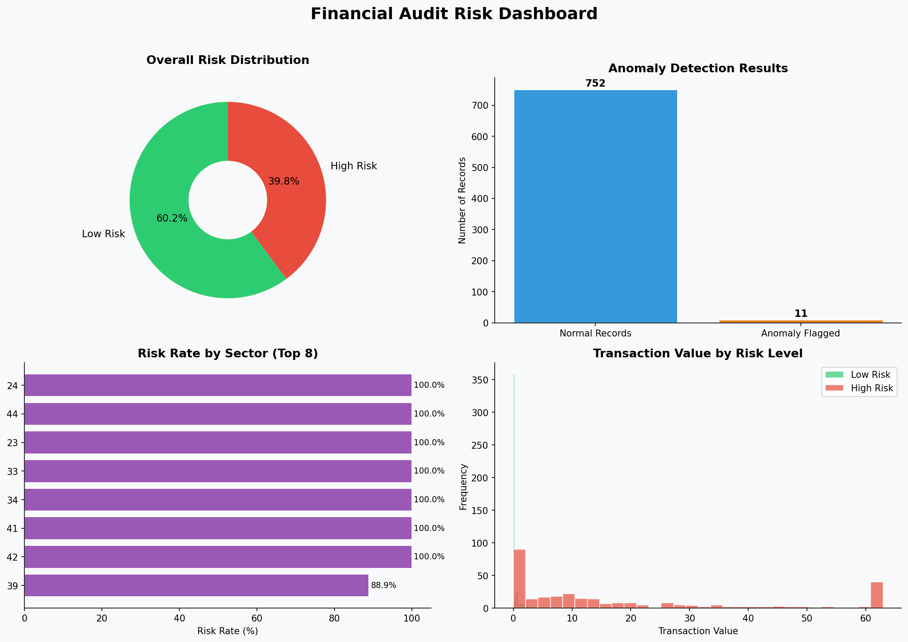

# Financial Audit Risk Analytics Dashboard

> **Replicating real-world audit analytics workflows using Python and Excel — inspired by internship experience at BSR & Co. LLP (KPMG-affiliated)**

---

## Project Overview

This project analyses 776 records from a public audit risk dataset to identify financial risk patterns, detect anomalies, and produce an executive-level analytics dashboard — mirroring the data workflows used in professional audit engagements.

Built as part of an MSc Business Analytics programme at Warwick Business School.

---

## What This Project Does

- Performs automated data quality assessment (missing values, duplicates, type validation)
- Cleans and standardises 776 audit records using Python (pandas)
- Applies Z-score statistical method to detect financial anomalies
- Segments risk exposure by sector and transaction value
- Produces a 4-panel executive dashboard (matplotlib)
- Exports an annotated Excel report with an executive summary sheet

---

## Dashboard Preview



---

## Key Findings

| Metric | Value |
|--------|-------|
| Total records analysed | 776 |
| High-risk records identified | 304.0 |
| Overall risk rate | 39.8% |
| Anomalies detected (Z-score > 3) | 11.0 |
| Missing values filled | 1.0 |


---

## Tools & Technologies

| Tool | Purpose |
|------|---------|
| Python 3 | Core analysis language |
| pandas | Data loading, cleaning, wrangling |
| numpy | Numerical operations, Z-score |
| matplotlib | Dashboard visualisation |
| scipy | Statistical anomaly detection |
| Excel (openpyxl) | Executive report export |
| Jupyter Notebook | Interactive development environment |

---

## Project Structure

```
financial-audit-analytics/
│
├── audit_dashboard.ipynb       # Main analysis notebook
├── audit_dashboard.png         # Exported dashboard image
├── Audit_Analytics_Report.xlsx # Excel executive summary
├── audit_data_cleaned.csv      # Cleaned dataset output
└── README.md                   # This file
```

---

## How to Run

**1. Clone the repository**
```bash
git clone https://github.com/YOUR_USERNAME/financial-audit-analytics.git
cd financial-audit-analytics
```

**2. Install dependencies**
```bash
pip install pandas numpy matplotlib scipy openpyxl jupyter
```

**3. Download the dataset**

Download `audit_risk.csv` from [Kaggle — Audit Data Risk Dataset](https://www.kaggle.com/datasets/sid321axn/audit-data) and place it in the project root folder.

**4. Run the notebook**
```bash
jupyter notebook audit_dashboard.ipynb
```

Run all cells in order. The dashboard image and Excel report will be saved automatically.

---

## Skills Demonstrated

- **Data wrangling** — cleaning and standardising real financial records at scale
- **Anomaly detection** — applying Z-score statistical method to flag high-risk transactions
- **Business intelligence** — translating raw audit data into executive-ready insights
- **Data visualisation** — building multi-panel dashboards for non-technical stakeholders
- **Reporting automation** — generating structured Excel reports programmatically

---

## Background & Motivation

During my internship at BSR & Co. LLP (KPMG-affiliated), I manually performed financial data cleaning and reconciliation using Alteryx — improving dataset accuracy across 10,000+ records. This project recreates and extends that workflow in Python, demonstrating how the same audit analytics process can be automated and scaled.

---

## About

**Shreya Johar** | MSc Business Analytics, Warwick Business School  
[LinkedIn](https://linkedin.com/in/shreya-johar-6816a424b) · shreyajohar20@gmail.com
